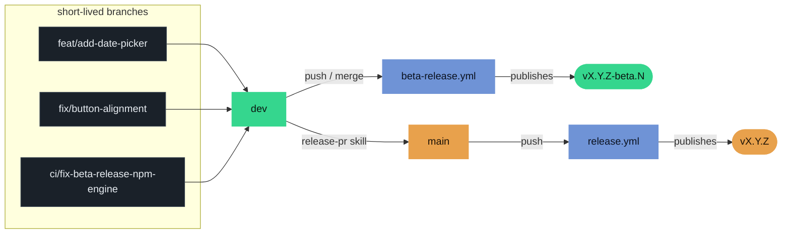
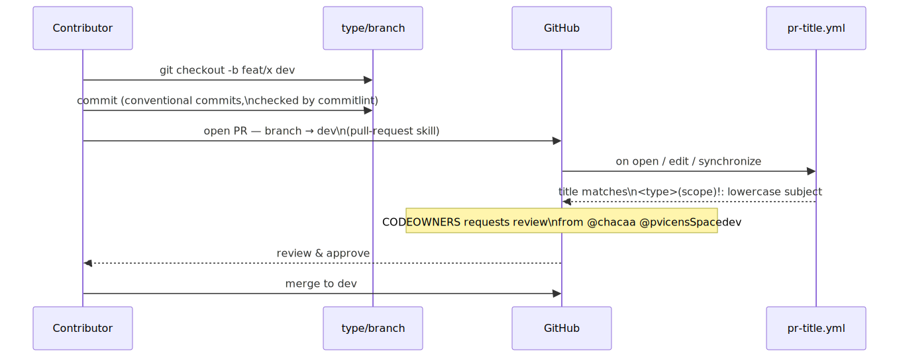
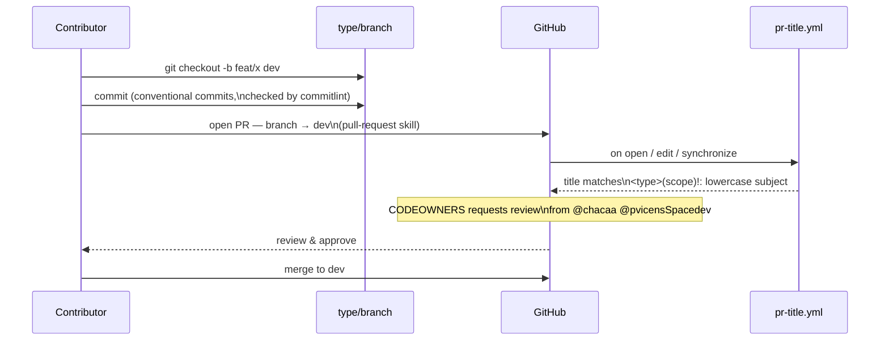
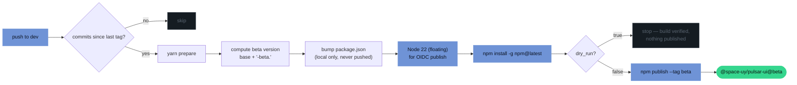
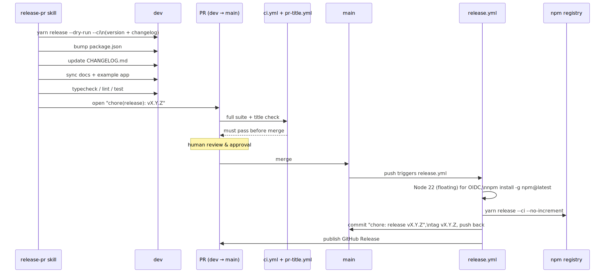
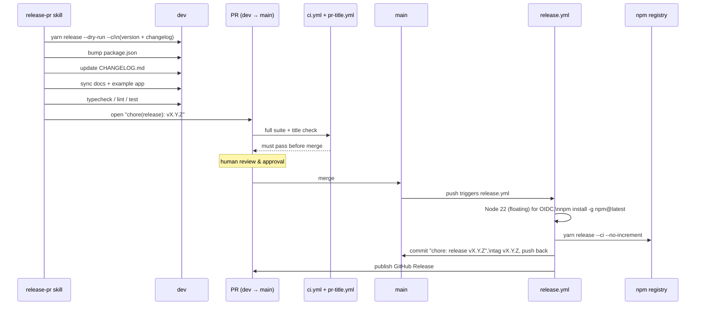
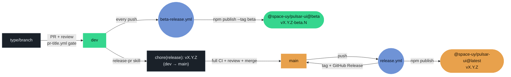

<style>
h1, h2, h3 { border-bottom: none !important; }

details { margin: 0 0 2em; }
details > summary { cursor: pointer; color: #5b6b7a; }

table {
  border-collapse: collapse;
  width: 100%;
  margin: 1em 0 1.75em;
  font-size: 0.95em;
}
th, td {
  border: 1px solid #d6dde3;
  padding: 0.55em 1em;
  text-align: left;
  vertical-align: top;
}
th {
  background: #eef1f4;
  font-weight: 600;
}
tr:nth-child(even) td {
  background: #f8f9fb;
}
td code, th code {
  white-space: nowrap;
}

@media (prefers-color-scheme: dark) {
  details > summary { color: #8b97a3; }
  th, td { border-color: #3a4552; }
  th { background: #1a2129; color: #e8edf2; }
  tr:nth-child(even) td { background: #161c22; }
}
</style>

# Collaboration & Release Process

How branching, pull requests, and releases work in `@space-uy/pulsar-ui`.
This ties together the rules in [CONTRIBUTING.md](./CONTRIBUTING.md) and
[VERSIONING.md](./VERSIONING.md) with what actually runs in CI
(`.github/workflows/`) and in the `pull-request` / `release-pr` skills.

## 1. Branch model

Two long-lived branches:

- **`main`** — production. Always what's published on npm under the
  `latest` dist-tag. Only moves via the release PR in section 4.
- **`dev`** — integration branch. Every push publishes a beta version to npm
  (section 3), so `dev` is always installable, just not "stable".

Everything else is a **short-lived, type-prefixed branch** cut from `dev`.

<div style="overflow-x: auto;">
<picture>
  <source media="(prefers-color-scheme: dark)" srcset="./assets/diagrams/01-branch-model-dark.svg">
  
</picture>
</div>

<details>
<summary>Diagram source</summary>



</details>

### Branch naming

`<type>/<short-description>`, enforced by a lefthook `pre-push` hook (`main`
and `dev` are exempt):

| Prefix | Use for |
|---|---|
| `feat/` | New features |
| `fix/` | Bug fixes |
| `docs/` | Documentation-only changes |
| `chore/` | Tooling, dependency bumps, misc maintenance |
| `refactor/` | Code refactors with no behavior change |
| `test/` | Adding/updating tests |
| `perf/` | Performance improvements |
| `ci/` | CI/CD or workflow changes |
| `build/` | Build system changes |
| `style/` | Formatting-only changes |
| `revert/` | Reverting a previous change |

Examples: `feat/add-date-picker`, `fix/button-alignment`,
`ci/fix-beta-release-npm-engine`.

## 2. Making a change and opening a PR

<div style="overflow-x: auto;">
<picture>
  <source media="(prefers-color-scheme: dark)" srcset="./assets/diagrams/02-pr-flow-dark.svg">
  
</picture>
</div>

<details>
<summary>Diagram source</summary>



</details>

What's actually enforced:

- **Commit messages** follow [Conventional Commits](https://www.conventionalcommits.org/en)
  (`feat`, `fix`, `docs`, `style`, `refactor`, `perf`, `test`, `build`, `ci`,
  `chore`, `revert`) — checked locally by the `commitlint` lefthook
  `commit-msg` hook.
- **PR titles** follow the same format (`<type>(scope)!: lowercase
  subject`) — checked remotely by
  [`pr-title.yml`](./.github/workflows/pr-title.yml) on every PR, regardless
  of base branch. Matters even more on squash-merge, since the PR title
  becomes the commit message.
- **Lint/typecheck** run locally on staged files via the lefthook
  `pre-commit` hook.
- **Full CI (lint, typecheck, test, build-library, build-web) only runs on
  PRs targeting `main`** — [`ci.yml`](./.github/workflows/ci.yml) scopes its
  `pull_request` trigger to `branches: [main]`. PRs into `dev` aren't gated
  by the test suite in CI; they rely on the local lefthook hooks above plus
  human review. The full suite runs later, as a gate on the release PR
  itself (section 4).
- Open PRs with the **`pull-request`** skill (`/pull-request` or
  `/pull-request --branch:"<name>"`) — it generates a compliant title and
  fills in `.github/pull_request_template.md` from the actual diff.

## 3. Beta releases — automatic, on every push to `dev`

Every push to `dev`, including a merged PR, triggers
[`beta-release.yml`](./.github/workflows/beta-release.yml). No manual step —
this is how `dev` stays continuously installable for testing.

<div style="overflow-x: auto;">
<picture>
  <source media="(prefers-color-scheme: dark)" srcset="./assets/diagrams/03-beta-release-dark.svg">
  
</picture>
</div>

<details>
<summary>Diagram source</summary>



</details>

The version is `<base-version>-beta.<github.run_number>` (e.g.
`0.12.0-beta.42`) — bumped only in the ephemeral runner's `package.json`,
never committed, so it can't collide with the real `release-pr` version
diffing. The same workflow also takes a manual `workflow_dispatch` with a
`dry_run` input, which runs the full build and version computation without
publishing — the mechanism used to validate pipeline fixes safely.

To try unreleased `dev` work:

```sh
yarn add @space-uy/pulsar-ui@beta
```

## 4. Stable releases — `dev` → `main`, reviewed

Stable releases are not automatic. They go through a reviewed PR from `dev`
into `main`, prepared with the **`release-pr`** skill.

<div style="overflow-x: auto;">
<picture>
  <source media="(prefers-color-scheme: dark)" srcset="./assets/diagrams/04-stable-release-dark.svg">
  
</picture>
</div>

<details>
<summary>Diagram source</summary>



</details>

What the skill does, in order:

1. Verifies you're on `dev` — refuses to run anywhere else.
2. Computes the real version bump from conventional commits since the last
   tag via `yarn release --dry-run --ci` (same `release-it` +
   `@release-it/conventional-changelog` pipeline CI uses — never
   hand-guessed).
3. Bumps `package.json`'s `"version"` to that value. This is load-bearing:
   `release.yml` runs `yarn release --ci --no-increment`, which publishes
   whatever version is already committed — if this doesn't match step 2, CI
   ships the wrong version.
4. Prepends a new section to `CHANGELOG.md`, grouped by commit type.
5. Syncs the docs site (`docs/src/content/docs/...`) and the example app
   (`example/app/ui-kit/...`) for any changed component or util.
6. Runs `yarn typecheck && yarn lint && yarn test` as a safety gate — stops
   on any failure.
7. Opens the PR titled `chore(release): vX.Y.Z`, marking "🚀 Release of new
   version" in the PR template.

**Merging that PR to `main` is what actually publishes to npm.** From there,
[`release.yml`](./.github/workflows/release.yml):

- Skips itself if the triggering commit message contains `chore: release` —
  this is what stops `release-it`'s own commit-and-push-back from
  re-triggering the workflow in a loop.
- Floats to `node-version: '22'` rather than a pinned patch for the publish
  step, and deliberately omits `registry-url` — passing it makes
  `actions/setup-node` write a placeholder npm auth token, which breaks the
  OIDC trusted-publishing exchange (`package.json`'s `publishConfig` already
  points npm at the right registry).
- Runs `yarn release --ci --no-increment`, which publishes the exact version
  in `package.json`, tags `vX.Y.Z`, generates the GitHub Release, and pushes
  a `chore: release vX.Y.Z` commit back to `main`.

## 5. Full picture

<div style="overflow-x: auto;">
<picture>
  <source media="(prefers-color-scheme: dark)" srcset="./assets/diagrams/05-full-picture-dark.svg">
  
</picture>
</div>

<details>
<summary>Diagram source</summary>



</details>

| Workflow | Trigger | Publishes? | Purpose |
|---|---|---|---|
| [`pr-title.yml`](./.github/workflows/pr-title.yml) | Any PR opened/edited/synced/reopened | No | Enforces Conventional Commits PR titles |
| [`ci.yml`](./.github/workflows/ci.yml) | Push to `main`, PR into `main`, merge queue | No | Lint, typecheck, test, build library, build web example |
| [`beta-release.yml`](./.github/workflows/beta-release.yml) | Push to `dev`, or manual `workflow_dispatch` (with `dry_run`) | Yes — `beta` tag | Automatic pre-release on every `dev` change |
| [`release.yml`](./.github/workflows/release.yml) | Push to `main` (self-guarded against its own release commit) | Yes — `latest` tag | Stable release, tag, GitHub Release |
| [`deploy-docs.yml`](./.github/workflows/deploy-docs.yml) | (see file) | No | Publishes the docs site |
| [`stale.yml`](./.github/workflows/stale.yml) | Weekly schedule | No | Labels/closes stale issues & PRs |

## 6. Quick reference

- **Starting new work**: `git checkout -b <type>/<short-description> dev`
- **Opening a PR into `dev`**: use the `/pull-request` skill
- **Trying unreleased `dev` work**: `yarn add @space-uy/pulsar-ui@beta`
- **Cutting a stable release**: use the `/release-pr` skill from `dev` — it
  opens the `dev → main` PR; merging it publishes to npm
- **Dry-running the beta pipeline** (e.g. to validate a CI change without
  publishing): `gh workflow run beta-release.yml --ref <branch> -f dry_run=true`
