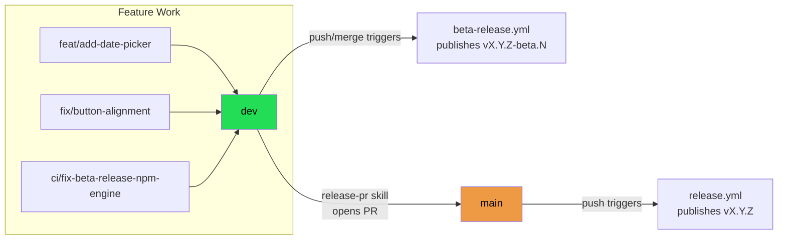
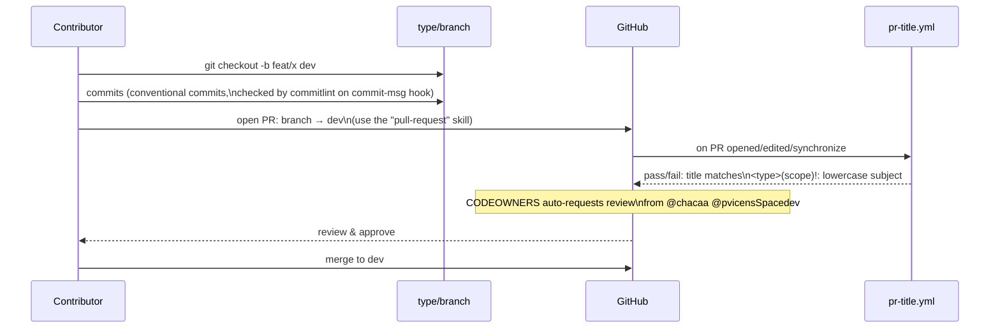
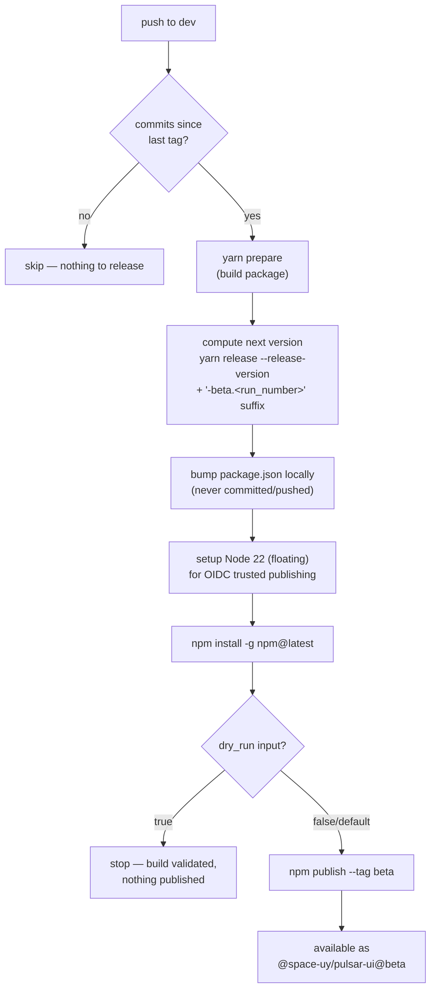
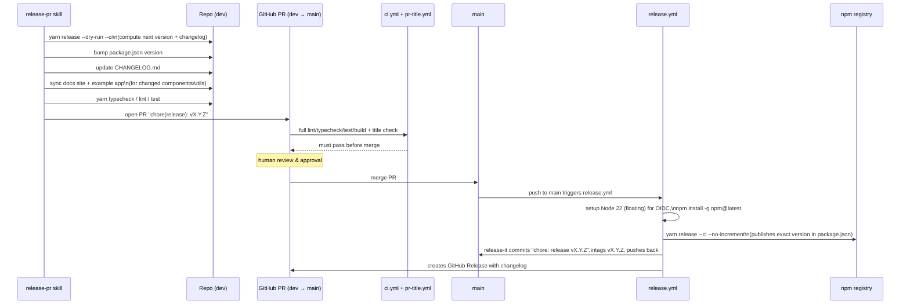
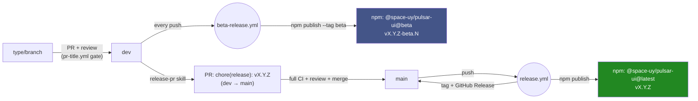

# Collaboration & Release Process

This document describes how branching, pull requests, and releases (beta and
stable) work end-to-end in `@space-uy/pulsar-ui`. It ties together the rules
already defined in [CONTRIBUTING.md](./CONTRIBUTING.md) and
[VERSIONING.md](./VERSIONING.md) with what actually happens in CI
(`.github/workflows/`) and in the `pull-request` / `release-pr` Claude skills.

## 1. Branch model

There are two long-lived branches:

- **`main`** — production. Always installable, always what's currently
  published on npm under the `latest` dist-tag. Protected; only updated via
  the release PR described in section 4.
- **`dev`** — integration branch. All feature/fix/chore work lands here
  first. Every push to `dev` automatically publishes a beta version to npm
  (section 3) — so `dev` is always installable too, just not "stable".

Short-lived work happens on **type-prefixed branches** created off `dev`.



### Branch naming rules

All branches must follow `<type>/<short-description>`, enforced by a lefthook
`pre-push` hook (bypassed only for `main` and `dev` themselves):

| Prefix | Use for |
|---|---|
| `feat/` | New features |
| `fix/` | Bug fixes |
| `docs/` | Documentation-only changes |
| `chore/` | Tooling, dependency bumps, misc maintenance |
| `refactor/` | Code refactors with no behavior change |
| `test/` | Adding/updating tests |
| `perf/` | Performance improvements |
| `ci/` | CI/CD or workflow changes |
| `build/` | Build system changes |
| `style/` | Formatting-only changes |
| `revert/` | Reverting a previous change |

Examples: `feat/add-date-picker`, `fix/button-alignment`,
`ci/fix-beta-release-npm-engine`.

## 2. Making a change and opening a PR



Rules enforced along the way:

- **Commit messages** must follow [Conventional Commits](https://www.conventionalcommits.org/en)
  (`feat`, `fix`, `docs`, `style`, `refactor`, `perf`, `test`, `build`, `ci`,
  `chore`, `revert`) — checked locally by the `commitlint` lefthook
  `commit-msg` hook.
- **PR titles** must also follow Conventional Commits format
  (`<type>(scope)!: lowercase subject`) — checked remotely by
  [`pr-title.yml`](./.github/workflows/pr-title.yml) on every PR, regardless
  of base branch. This matters even more if the repo squash-merges, since the
  PR title becomes the squash commit message.
- **Lint/typecheck** run locally on staged files via the lefthook
  `pre-commit` hook.
- **⚠️ Full CI (lint, typecheck, test, build-library, build-web) only runs on
  PRs targeting `main`** (see [`ci.yml`](./.github/workflows/ci.yml) — its
  `pull_request` trigger is scoped to `branches: [main]`). PRs into `dev` are
  **not** gated by the full test suite in CI; they rely on the local lefthook
  hooks above plus human review. The full suite runs later, as a gate on the
  release PR itself (section 4).
- Use the **`pull-request`** skill (`/pull-request` or `/pull-request
  --branch:"<name>"`) to open PRs — it generates a compliant title and fills
  in `.github/pull_request_template.md` from the actual diff.

## 3. Beta releases (automatic, on every push to `dev`)

Every push to `dev` — including a PR merge — triggers
[`beta-release.yml`](./.github/workflows/beta-release.yml) automatically.
There is no manual step for this; it's how `dev` stays continuously
installable for testing.



Key points:

- Version format: `<base-version>-beta.<github.run_number>` (e.g.
  `0.12.0-beta.42`) — never collides with the real release-pr version
  diffing, since it's only bumped in the ephemeral runner's `package.json`,
  never committed.
- Can also be triggered manually via `workflow_dispatch` with a `dry_run`
  input — runs the full build and version computation without publishing.
  This is the mechanism used to validate pipeline fixes safely.
- Consumers who want to try unreleased `dev` work install with:
  ```sh
  yarn add @space-uy/pulsar-ui@beta
  ```

## 4. Stable releases (`dev` → `main`, manual/reviewed)

Stable releases are **not automatic** — they go through a reviewed PR from
`dev` into `main`, prepared with the **`release-pr`** skill.



What the **`release-pr`** skill does, in order:

1. Verifies you're on `dev` — refuses to run from anywhere else.
2. Computes the real version bump from conventional commits since the last
   tag via `yarn release --dry-run --ci` (same `release-it` +
   `@release-it/conventional-changelog` pipeline CI uses — never hand-guessed).
3. Bumps `package.json`'s `"version"` to that computed value. This is load
   bearing: `release.yml` runs `yarn release --ci --no-increment`, which
   publishes whatever version is already committed, so if this doesn't match
   step 2's output, CI ships the wrong version.
4. Prepends a new section to `CHANGELOG.md`, grouped by conventional-commit
   type.
5. Syncs the docs site (`docs/src/content/docs/...`) and the example app
   (`example/app/ui-kit/...`) for any changed/added/removed component or
   util.
6. Runs `yarn typecheck && yarn lint && yarn test` as a safety gate — stops
   if any fail.
7. Opens the PR with title `chore(release): vX.Y.Z`, marking "🚀 Release of
   new version" in the PR template's type-of-change checklist.

**Merging that PR to `main` is what actually publishes to npm.** From there:

- [`release.yml`](./.github/workflows/release.yml) runs on the `main` push,
  skipping itself if the triggering commit message contains `chore: release`
  (this is what stops `release-it`'s own commit-and-push-back from
  re-triggering the workflow in a loop).
- It floats to `node-version: '22'` (not a pinned patch) for the publish
  step, and deliberately **omits** `registry-url` — passing it makes
  `actions/setup-node` write a placeholder npm auth token, which breaks the
  OIDC trusted-publishing exchange (`package.json`'s `publishConfig` already
  points npm at the right registry).
- `yarn release --ci --no-increment` publishes the exact version already in
  `package.json`, creates the `vX.Y.Z` git tag, generates the GitHub Release,
  and pushes a `chore: release vX.Y.Z` commit back to `main`.

## 5. Full picture



| Workflow | Trigger | Publishes? | Purpose |
|---|---|---|---|
| [`pr-title.yml`](./.github/workflows/pr-title.yml) | Any PR opened/edited/synced/reopened | No | Enforces Conventional Commits PR titles |
| [`ci.yml`](./.github/workflows/ci.yml) | Push to `main`, PR into `main`, merge queue | No | Lint, typecheck, test, build library, build web example |
| [`beta-release.yml`](./.github/workflows/beta-release.yml) | Push to `dev`, or manual `workflow_dispatch` (with `dry_run` option) | Yes — `beta` tag | Automatic pre-release on every `dev` change |
| [`release.yml`](./.github/workflows/release.yml) | Push to `main` (self-guarded against its own release commit) | Yes — `latest` tag | Stable release, tag, and GitHub Release |
| [`deploy-docs.yml`](./.github/workflows/deploy-docs.yml) | (see file) | No | Publishes the docs site |
| [`stale.yml`](./.github/workflows/stale.yml) | Weekly schedule | No | Labels/closes stale issues & PRs |

## 6. Quick reference

- **Starting new work**: `git checkout -b <type>/<short-description> dev`
- **Opening a PR into `dev`**: use the `/pull-request` skill
- **Trying out unreleased `dev` work**: `yarn add @space-uy/pulsar-ui@beta`
- **Cutting a stable release**: use the `/release-pr` skill from `dev` — it
  opens the `dev → main` PR; merging it publishes to npm automatically
- **Dry-running the beta pipeline** (e.g. to validate a CI change without
  publishing): `gh workflow run beta-release.yml --ref <branch> -f dry_run=true`
