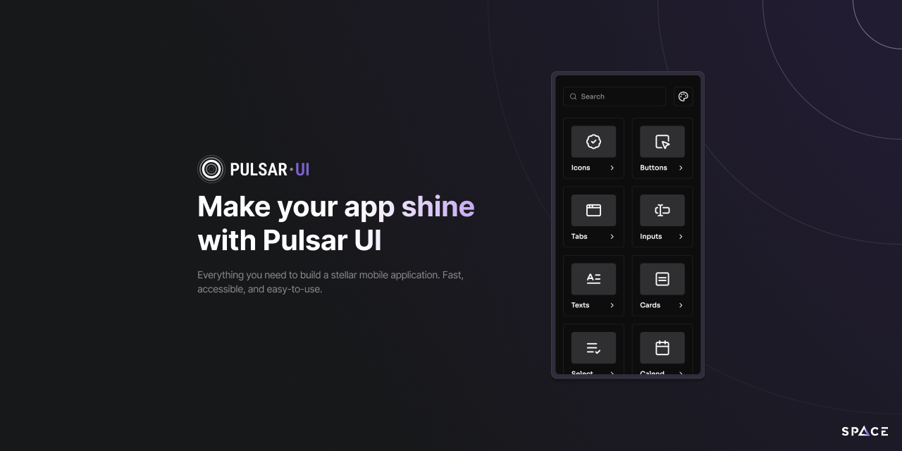

<div align="right">




[](CONTRIBUTING.md)

</div>

## ✨ Features

- 🎨 Modern and consistent design system
- 📱 Cross-platform components for iOS, Android and Web
- 🚀 Built with performance in mind
- 📦 Easy to integrate and use
- 🔧 Fully typed with TypeScript
- 🎯 Comprehensive component library
- 🌈 Theme support
- 📖 Well-documented components

## 📦 Installation

```sh
# Using npm
npm install @space-uy/pulsar-ui

# Using yarn
yarn add @space-uy/pulsar-ui
```

### Install peer dependencies:

```sh
# Using npm
npm install react-native-svg react-native-gesture-handler react-native-reanimated lucide-react-native zustand @react-navigation/elements

# Using yarn
yarn add react-native-svg react-native-gesture-handler react-native-reanimated lucide-react-native zustand @react-navigation/elements
```

## 🚀 Quick Start

```tsx
import React from 'react';
import { View, StyleSheet } from 'react-native';
import { Button, Text, Card } from '@space-uy/pulsar-ui';

export default function App() {
  const handlePress = () => {
    console.log('Button pressed!');
  };

  return (
    <View style={styles.container}>
      <Card style={styles.card}>
        <Text variant="h2" style={styles.title}>
          Welcome to Pulsar UI
        </Text>
        <Text variant="pm" style={styles.description}>
          This is a basic example of how to use our components.
        </Text>
        <Button
          text="Get Started"
          onPress={handlePress}
          iconName="ArrowRight"
        />
      </Card>
    </View>
  );
}

const styles = StyleSheet.create({
  container: {
    flex: 1,
    padding: 20,
    justifyContent: 'center',
  },
  card: {
    padding: 20,
  },
  title: {
    marginBottom: 12,
  },
  description: {
    marginBottom: 20,
    opacity: 0.7,
  },
});
```

## 📚 Documentation

For detailed documentation, examples, and interactive playground, visit:

**🌐 [Pulsar UI Documentation & Playground](https://spaceuy.github.io/pulsar-ui/)**

## 🛠️ Development

### Prerequisites

- Node.js (version specified in `.nvmrc`)
- Yarn (version 3.6.1 or later)
- React Native development environment set up

### Setup

1. Clone the repository:

```sh
git clone https://github.com/SpaceUY/pulsar-ui.git
cd pulsar-ui
```

2. Install dependencies:

```sh
yarn install
```

3. Start the example app:

```sh
yarn example
```

### Available Scripts

- `yarn example` - Run the example app
- `yarn test` - Run tests
- `yarn typecheck` - Run TypeScript type checking
- `yarn lint` - Run ESLint
- `yarn clean` - Clean build files
- `yarn prepare` - Build the library

## 🤝 Contributing

We welcome contributions! Please see our [Contributing Guide](CONTRIBUTING.md) for details on how to submit pull requests, report issues, and more.

## 📄 License

MIT © [SpaceDev](https://github.com/SpaceUY)

---

Made with [create-react-native-library](https://github.com/callstack/react-native-builder-bob)
